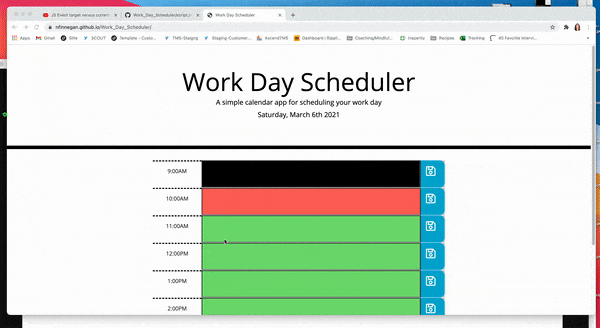

# Work_Day_Scheduler

## Project Overview
For this application I was tasked with creating a Work Day Scheduler. While I made a few minor tweaks to the CSS, the bulk of the HTML & CSS were provided. 

## Description
In the 5th week of bootcamp we spent our time learning about Third-Party-APIs, this really unlocked a lot of tools available to developers in order to streamline workflows and improve effiencies. I capitlized on third party APIs, by using jQuery almost exclusively along with boostrap for my formatting. 

## User Story
```md
AS AN employee with a busy schedule
I WANT to add important events to a daily planner
SO THAT I can manage my time effectively
```

## Acceptance Criteria
```md
GIVEN I am using a daily planner to create a schedule
WHEN I open the planner
THEN the current day is displayed at the top of the calendar
WHEN I scroll down
THEN I am presented with timeblocks for standard business hours
WHEN I view the timeblocks for that day
THEN each timeblock is color coded to indicate whether it is in the past, present, or future
WHEN I click into a timeblock
THEN I can enter an event
WHEN I click the save button for that timeblock
THEN the text for that event is saved in local storage
WHEN I refresh the page
THEN the saved events persist
```

## Deployed Application
Link to deployed application: https://nfinnegan.github.io/Work_Day_Scheduler/

## Preview



